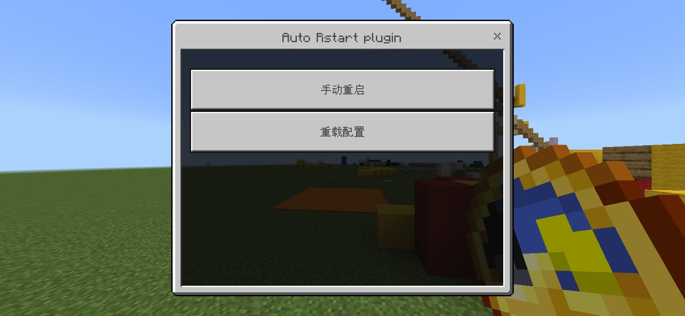
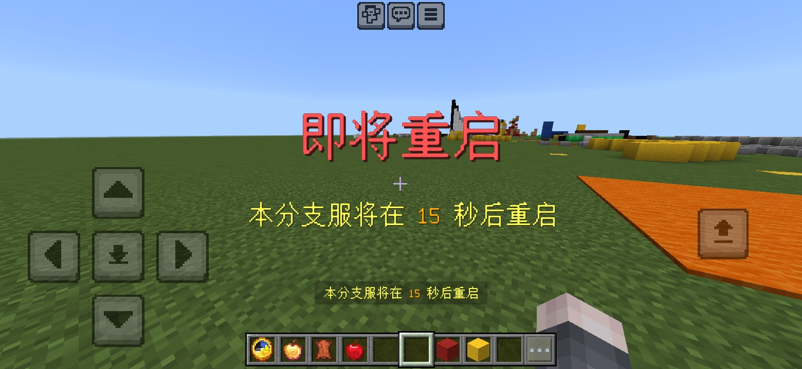
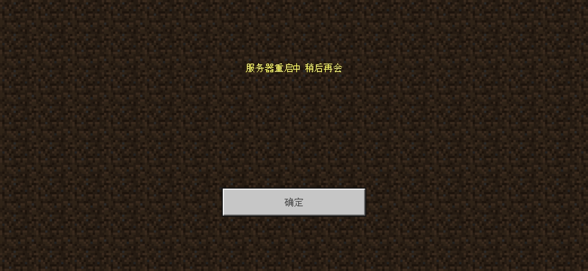

# **AutoRestart 自动重启**
[](LICENSE)

[](https://github.com/stevei5mc/AutoRestart/releases)  


  
## **插件介绍**
### **功能介绍**
1. **支持多语言（根据玩家客户端的语言进行匹配）**
2. **支持播放音效提醒玩家（暂时只支持mc原有的）**
3. **支持取消自动重启任务**
4. **支持手动运行重启任务（手动重启的时间为配置文件中的提示时间）**
### **命令与权限**
|命令|权限节点|命令/权限介绍|默认权限|
|:-:|:-:|:-:|:-:|
|/autorestart|autorestart.admin|主命令|OP|
|/autorestart reload|autorestart.admin.reload|重载配置文件|OP|
|/autorestart cancel|autorestart.admin.cancel|取消重启任务|OP|
|/autorestart restart|autorestart.admin.restart|手动重启|OP|
### **配置文件介绍**
```yml
#默认语言
default_language: zh_CN
#重启时间(分钟 min)
restart_time: 180
#提示时间(秒 s)
tips_time: 30
#是否在重启前把玩家踢出
kick_player: true
#一些显示的设置
#显示title(包括subtitle)
show_title: true
#底部显示(在物品栏上方)
show_tip: true
#是否播放音效
play_sound: true
sound:
  name: "random.toast"
  volume: 1.0
  pitch: 1.0
```
### **支持的语言**

- [x] en_US   English (United States)
- [ ] en_GB   English (United Kingdom)
- [ ] de_DE   Deutsch (Deutschland)
- [ ] es_ES   Español (España)
- [ ] es_MX   Español (México)
- [ ] fr_FR   Français (France)
- [ ] fr_CA   Français (Canada)
- [ ] it_IT   Italiano (Italia)
- [ ] ja_JP   日本語 (日本)
- [ ] ko_KR   한국어 (대한민국)
- [ ] pt_BR   Português (Brasil)
- [ ] pt_PT   Português (Portugal)
- [ ] ru_RU   Русский (Россия)
- [x] zh_CN   中文(简体)
- [x] zh_TW   中文(繁體)
- [ ] nl_NL   Nederlands (Nederland)
- [ ] bg_BG   Български (България)
- [ ] cs_CZ   Čeština (Česko)
- [ ] da_DK   Dansk (Danmark)
- [ ] el_GR   Ελληνικά (Ελλάδα)
- [ ] fi_FI   Suomi (Suomi)
- [ ] hu_HU   Magyar (Magyarország)
- [ ] id_ID   Indonesia (Indonesia)
- [ ] nb_NO   Norsk bokmål (Norge)
- [ ] pl_PL   Polski (Polska)
- [ ] sk_SK   Slovenčina (Slovensko)
- [ ] sv_SE   Svenska (Sverige)
- [ ] tr_TR   Türkçe (Türkiye)
- [ ] uk_UA   Українська (Україна)
## **使用方法**
1. **将插件放进`plugins`文件夹，并确保安装[MemoriesOfTime-GameCore](https://motci.cn/job/GameCore/)插件后重启服务器**  
2. **启动(重启)服务器并调整好配置(如何配置请看插件介绍)，并重启服务器**
3. **自动重启还需要脚本的配合才能实现相关脚本在[Actions](https://github.com/stevei5mc/NewTipsVariables/actions)编译完成后会一并给出，你也可以到对应[仓库](https://github.com/stevei5mc/McStartServer)获取，[Releases](https://github.com/stevei5mc/AutoRestart/releases)中也可以获取得到但只会在版本发布后才会有相关脚本(Windows用.bat后缀的脚本，Linux请用.sh后缀的脚本，另外每种系统的脚本都有两个根据你的需求选择)，如果你已经有了相关脚本则可以忽略这一步骤**
## **效果预览**
|||
|-|-|
|||