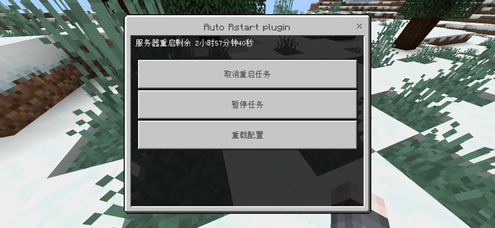
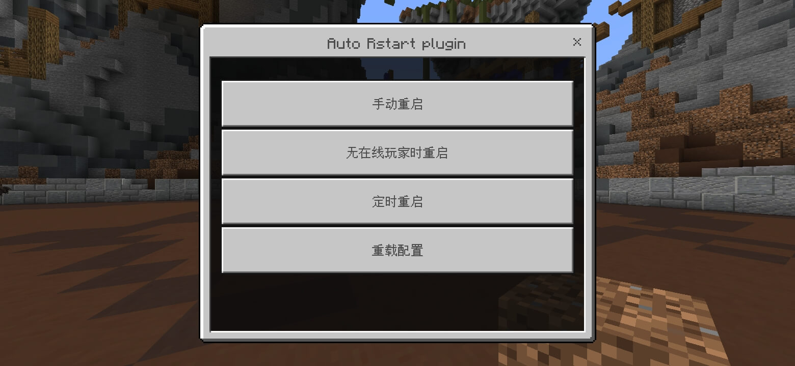

# **AutoRestart 自动重启**
[](LICENSE)

[](https://github.com/stevei5mc/AutoRestart/releases)  


## **插件介绍**
### **功能介绍**
- [x] **多语言（根据玩家客户端的语言进行匹配）**
- [x] **播放音效提醒玩家（暂时只支持mc原有的）**
- [x] **取消自动重启任务**
- [ ] **暂停任务 （敬请期待）**
### **任务类型**
- [x] **定时重启**
- [x] **手动重启（手动重启的时间为配置文件中的提示时间）**
- [x] **服务器无人时自动重启**
- [ ] **投票重启 （敬请期待）**
### **命令与权限**
|命令|权限节点|命令/权限介绍|默认权限|
|:-:|:-:|:-|:-:|
|/autorestart|autorestart.admin|主命令、打开GUI|OP|
|/autorestart reload|autorestart.admin.reload|重载配置文件|OP|
|/autorestart cancel|autorestart.admin.cancel|取消重启任务|OP|
|/autorestart restart manual|autorestart.admin.restart|手动重启服务器|OP|
|/autorestart restart no-player|autorestart.admin.restart|在服务器没有玩家在线时自动重启服务器|OP|
|/voterestart|autorestart.user.vote|主命令、打开GUI|player|
|/voterestart initiate|autorestart.user.vote|发起投票|player|
|/voterestart vote approval|autorestart.user.vote|投出赞成票|player|
|/voterestart vote oppose|autorestart.user.vote|投出反对票|player|
|/voterestart vote veto|autorestart.admin.vote.veto|使用一票否决|OP|
### **配置文件介绍**
```yml
#默认语言
default_language: zh_CN
#重启时间(分钟 min)
restart_time: 180
#提示时间(秒 s)
tips_time: 30
#是否在重启前把玩家踢出
kick_player: true
#一些显示的设置
#显示title(包括subtitle)
show_title: true
#底部显示(在物品栏上方)
show_tip: true
#是否播放音效
play_sound: true
sound:
  name: "random.toast"
  volume: 1.0
  pitch: 1.0
#重启前执行的命令(&con为控制台执行 @p 代表玩家名)
runcommand: true
commands:
  - "say hello world&con"
  - "help"
  - "say hello @p&con"
```
### **支持的语言**
- **顺序按照支持的顺序排序**
- [x] zh_CN   中文(简体)
- [x] zh_TW   中文(繁體)
- [x] en_US   English (United States)
## **使用方法**
### **注意事项**
- **自动重启还需要脚本的配合才能实现相关脚本在[Actions](https://github.com/stevei5mc/NewTipsVariables/actions)编译完成后会一并给出，你也可以到对应[GITHUB 仓库](https://github.com/stevei5mc/McStartServer)获取，[Releases](https://github.com/stevei5mc/AutoRestart/releases)中也可以获取得到但只会在版本发布后才会有相关脚本(Windows用.bat后缀的脚本，Linux请用.sh后缀的脚本，另外每种系统的脚本都有两种根据你的需求选择)，如果你已经有了相关脚本则可以忽略**

### **脚本使用说明**
- **此内容使用于配套的启动脚本，可配置项已在下方列出**
- **如果你没有相关知识，请不要修改可配置项以外的地方**
- **可配置项是在`=`后面的，例如`jvm_ram_xms="512M"`的`512M`就为可配置项, 注：`""`可加可不加，如果无法运行可尝试加上`""`**

<details>
<summary>Windows</summary>

```bat
::设置用于启动的java版本 (默认填 java，当然你也可以填java的安装路径)
set java_version=java
::服务器名提示
set server_name=test
::设置最小内存
set ram_Xms=512m
::设置最大内存
set ram_Xmx=1024m
::设置开服核心名(开服核心名不用加.jar的后缀名)
set server_jar_name=server
::设置重启等待时间
set restart_time=20
```
</details>

<details>
<summary>Linux</summary>

```sh
ReStart_Time=5s  #等待多少秒后重启要加时间单位
jvm_ram_xms="512M"  #设置最小内存
jvm_ram_xmx="1024M"  #设置最大内存
jar_name="server.jar"  #开服核心的名字记得加.jar后缀名
server_name="testmc"  #服务名(方便维护用的)，比如说是生存服就将testmc改为生存服
```

```sh
ReStart_Time=20s  #等待多少秒后重启要加时间单位
jvm_ram_xms="512M"  #设置最小内存
jvm_ram_xmx="1024M"  #设置最大内存
jar_name="server.jar"  #开服核心的名字记得加.jar后缀名
```
</details>


|步骤|说明|
|:-:|:-|
|1|准备好相关的启动脚本并放置在服务端的根目录下(一般情况下启动脚本是放置在服务端的根目录下)并调整好启动脚本的配置(如果你有相关的启动脚本则无视这一步骤)|
|2|将本插件放进`plugins`文件夹，并确保安装前置插件[MemoriesOfTime-GameCore](https://motci.cn/job/GameCore/)后启动服务器 <br> 安装前置插件[Tips](https://motci.cn/job/Tips/)可让变量`{restart-remainder}`生效（这是可选的）|
|3|如果不使用默认配置则修改好配置文件后重启服务器让新的配置生效（由于自动重启任务的配置读取是在服务器启动阶段进行的，所以无法通过重载配置文件的操作让新的配置完全生效只能通过重启服务器来让新的配置生效）|
## **效果预览**
|||
|-|-|
|||
|||
## **[开发文档](docs/dev-doc.md)**